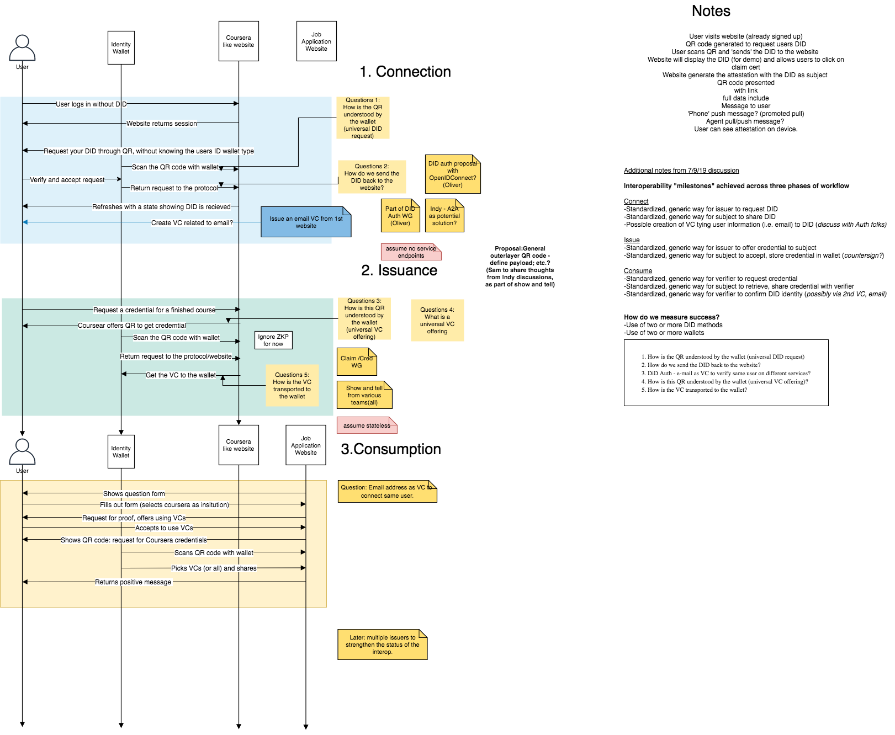

# InterOp Explainer

## Mission

The mission of the InterOp Project is to demonstrate interoperability amongst the specifications and implementations within the Decentralized Identity community, including non DIF members. Contributors focus on code and documentation, with a particular focus on supporting complements and substitutes to the technologies they may be developing within their host company or other working groups.

## Scope

The InterOp project does manage standards or specifications and relies on working groups within the DIF, W3C, Bitcoin, Ethereum, HyperLedger, and elsewhere. The interop project does not develop cipher suites or data format libraries, but we do build proof of concepts and demos. If a technology is not mature enough for use by other members of the community, the interop project may provide software shims or stubs to demonstrate interoperability.

## Credential Exchange CLI Demo

We provide a command line tool for demonstrating the creation, resolution and use of decentralized identifiers and verifiable credentials. [Learn More](https://github.com/decentralized-identity/interop-project/tree/master/cli-demo).

## Credential Exchange Web Demo

We are developing a web demo for credential issuance and exchange. We aim to support Mobile Wallets, Agents, Hubs and at least 3 DID Methods. Please see the [open issues](https://github.com/decentralized-identity/interop-project/issues) for more details.

### Technology Summary

Subject to change, we don't need to demonstrate interoperability everwhere.

|            | Issuer | Subject | Verifier |
| ---------- | ------ | ------- | -------- |
| DID Method | BTCR   | Various | TBD      |
| AuthN      | YES    | NO      | MAYBE    |
| Sign VC    | YES    | YES     | MAYBE    |
| Verify VC  | YES    | YES     | YES      |
| Hubs       | NO     | YES     | NO       |
| Agents     | NO     | YES     | NO       |
| Mobile     | NO     | YES     | NO       |
| Website    | YES    | NO      | YES      |

- [Block Diagram](https://drive.google.com/file/d/1BK-qVM1y9594viC_uhOrpx1Vozun1tsr/view)

